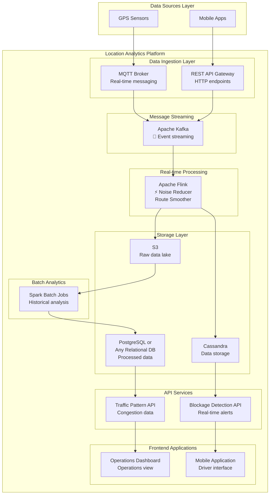

# Location Analytics Data Flow Architecture

## Data Flow Diagram

## Design Details
### Data Sources Layer
- **GPS Sensors**: Hardware devices in vehicles that capture location, speed, and timestamp data at regular intervals (typically every 30-60 seconds)
- **Mobile Apps**: Smartphone applications that collect GPS data from drivers and send location updates via HTTP APIs

### Data Ingestion Layer
- **MQTT Broker**: Lightweight messaging protocol optimized for IoT devices, handles real-time GPS data streams from vehicle sensors with low bandwidth overhead, <aws IoT>
- **REST API Gateway**: HTTP-based API endpoint that receives GPS data from mobile applications and provides authentication, rate limiting, and data validation

### Message Streaming
- **Apache Kafka**: Distributed event streaming platform that acts as a buffer between data sources and processing systems, ensuring fault-tolerant message delivery
- Provides scalable GPS data ingestion and enables multiple consumers to process the same data stream

### Real-time Processing
- **Apache Flink**: Low-latency stream processing engine that performs real-time GPS data cleaning, noise reduction, and route smoothing
- Implements stateful processing for spatial clustering and stoppage detection 

### Storage Layer
- **S3 / Object Storage (Raw Data Lake)**: Storage for archiving raw GPS data in analytics ready format, partitioned by date and geographic regions for efficient batch analytics
- **Cassandra**: NoSQL database optimized for time-series data, stores processed GPS points and real-time aggregations with high write throughput
- **PostgreSQL**: Relational database that stores aggregated traffic patterns, historical analytics results, and structured data for API queries. PostGIS extension for native geospatial queries and analysis.

### Batch Analytics
- **Spark Batch Jobs**: Scheduled processing jobs that analyze historical GPS data to identify traffic patterns, generate insights
- Processes large datasets from S3 to create aggregated views and performs complex analytics that don't require real-time processing
- aws glue as hosted and managed spark can be utilised.

### API Services
- **Blockage Detection API**: Real-time service that queries Cassandra for current traffic blockages and provides immediate alerts to mobile applications
- **Traffic Pattern API**: Service that serves historical traffic analysis and congestion data from PostgreSQL to power dashboards and reporting tools

### Frontend Applications
- **Operations Dashboard**: Web-based interface for traffic managers to monitor real-time traffic conditions, view analytics, and manage incidents
- **Mobile Application**: Driver-facing app that displays traffic alerts, optimal routes, and receives real-time blockage notifications for route optimization
