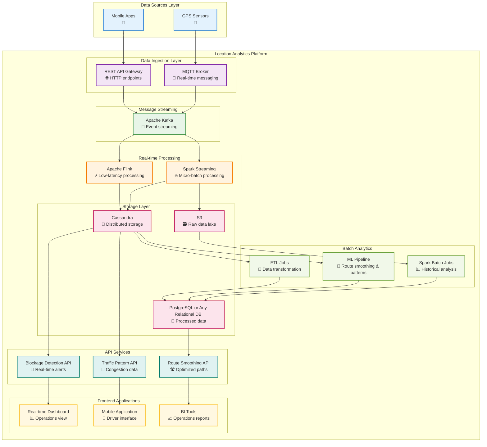

# Location Analytics Data Flow Architecture

## Data Flow Diagram

```mermaid
flowchart TD

    %% Data Sources
    subgraph "Data Sources Layer"
        GPS[GPS Sensors<br/>📡 ]
        MOBILE[Mobile Apps<br/>📱]
    end
    
    subgraph "Location Analytics Platform"
    %% Data Ingestion
    subgraph "Data Ingestion Layer"
        MQTT[MQTT Broker<br/>🔄 Real-time messaging]
        REST[REST API Gateway<br/>🌐 HTTP endpoints]
    end
    
    %% Message Queue
    subgraph "Message Streaming"
        KAFKA[Apache Kafka<br/>📨 Event streaming]
    end
    
    %% Stream Processing
    subgraph "Real-time Processing"
        SPARK_STREAM[Spark Streaming<br/>🔥 Micro-batch processing]
        FLINK[Apache Flink<br/>⚡ Low-latency processing]
    end
    
    %% Data Storage
    subgraph "Storage Layer"
        HDFS[S3<br/>🗃️ Raw data lake]
        CASSANDRA[Cassandra<br/>💾 Distributed storage]
        POSTGRES[PostgreSQL or Any Relational DB <br/>🐘 Processed data]
    end
    
    %% Batch Processing
    subgraph "Batch Analytics"
        SPARK_BATCH[Spark Batch Jobs<br/>📊 Historical analysis]
        ML_PIPELINE[ML Pipeline<br/>🤖 Route smoothing & patterns]
        ETL[ETL Jobs<br/>🔄 Data transformation]
    end
    
    %% Application Services
    subgraph "API Services"
        BLOCKAGE_API[Blockage Detection API<br/>🚫 Real-time alerts]
        TRAFFIC_API[Traffic Pattern API<br/>🚦 Congestion data]
        ROUTE_API[Route Smoothing API<br/>🛣️ Optimized paths]
    end
    
    %% Frontend Applications
    subgraph "Frontend Applications"
        DASHBOARD[Real-time Dashboard<br/>📊 Operations view]
        MOBILE_APP[Mobile Application<br/>📱 Driver interface]
        BI_TOOLS[BI Tools<br/>📈 Operations reports]
    end
    end

    %% Data Flow Connections
    GPS --> MQTT
    MOBILE --> REST
    
    MQTT --> KAFKA
    REST --> KAFKA
    
    KAFKA --> SPARK_STREAM
    KAFKA --> FLINK
    
    SPARK_STREAM --> CASSANDRA
    SPARK_STREAM --> HDFS
    FLINK --> CASSANDRA
    
    HDFS --> SPARK_BATCH
    CASSANDRA --> ML_PIPELINE
    CASSANDRA --> ETL
    
    SPARK_BATCH --> POSTGRES
    ML_PIPELINE --> POSTGRES
    ETL --> POSTGRES
    
    CASSANDRA --> BLOCKAGE_API
    CASSANDRA --> TRAFFIC_API
    POSTGRES --> ROUTE_API

    
    BLOCKAGE_API --> DASHBOARD
    TRAFFIC_API --> MOBILE_APP
    ROUTE_API --> BI_TOOLS

    
    %% Styling
    classDef source fill:#E3F2FD,stroke:#1976D2,stroke-width:2px
    classDef ingestion fill:#F3E5F5,stroke:#7B1FA2,stroke-width:2px
    classDef streaming fill:#E8F5E8,stroke:#388E3C,stroke-width:2px
    classDef processing fill:#FFF3E0,stroke:#F57C00,stroke-width:2px
    classDef storage fill:#FCE4EC,stroke:#C2185B,stroke-width:2px
    classDef batch fill:#F1F8E9,stroke:#689F38,stroke-width:2px
    classDef api fill:#E0F2F1,stroke:#00796B,stroke-width:2px
    classDef frontend fill:#FFF8E1,stroke:#FBC02D,stroke-width:2px
    
    class GPS,MOBILE source
    class MQTT,REST ingestion
    class KAFKA streaming
    class SPARK_STREAM,FLINK processing
    class HDFS,TIMESERIES,CASSANDRA,POSTGRES storage
    class SPARK_BATCH,ML_PIPELINE,ETL batch
    class BLOCKAGE_API,TRAFFIC_API,ROUTE_API api
    class DASHBOARD,MOBILE_APP,BI_TOOLS frontend
```
